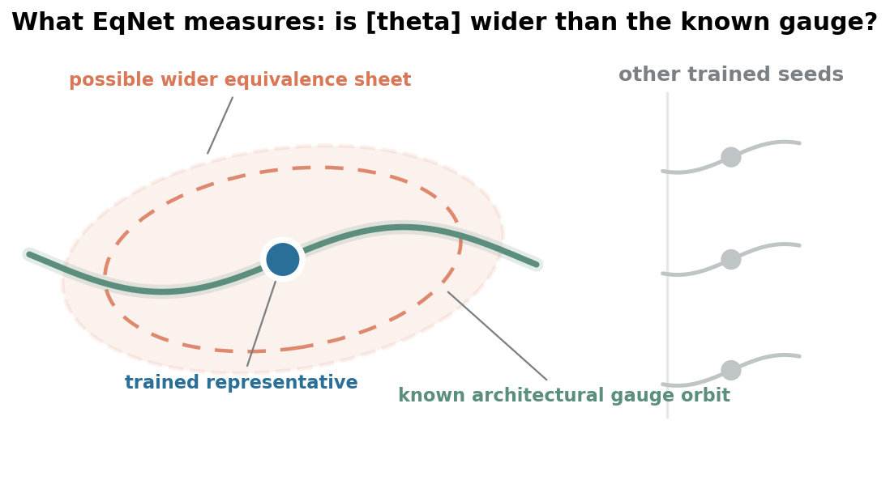
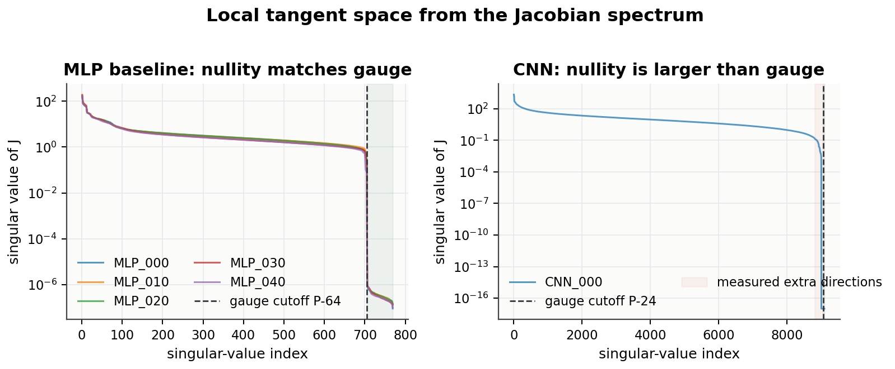
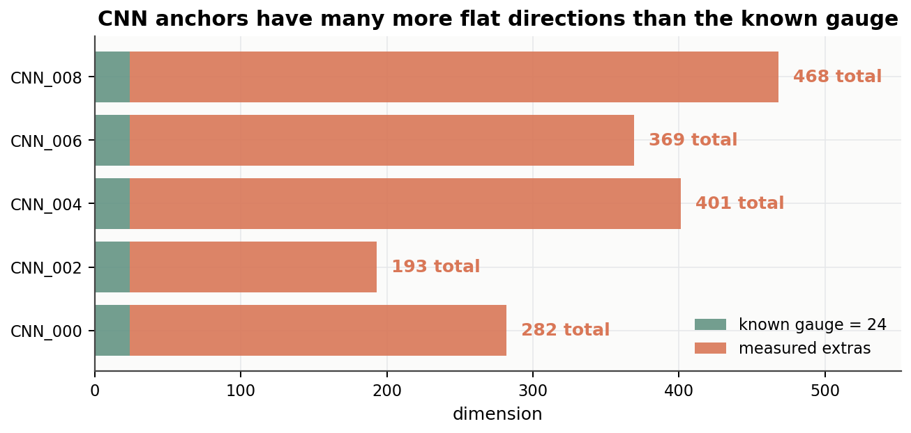
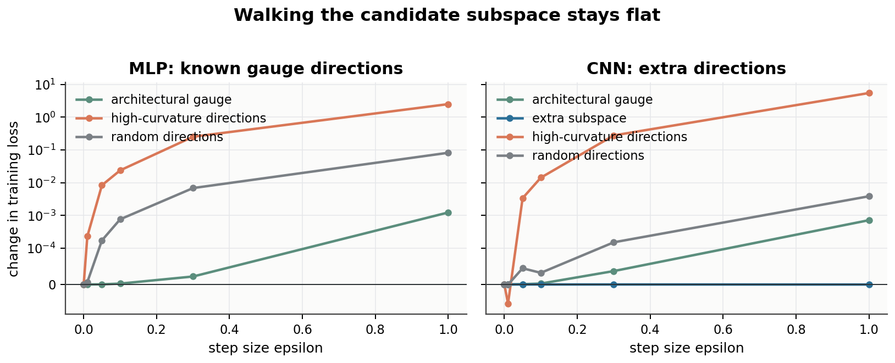
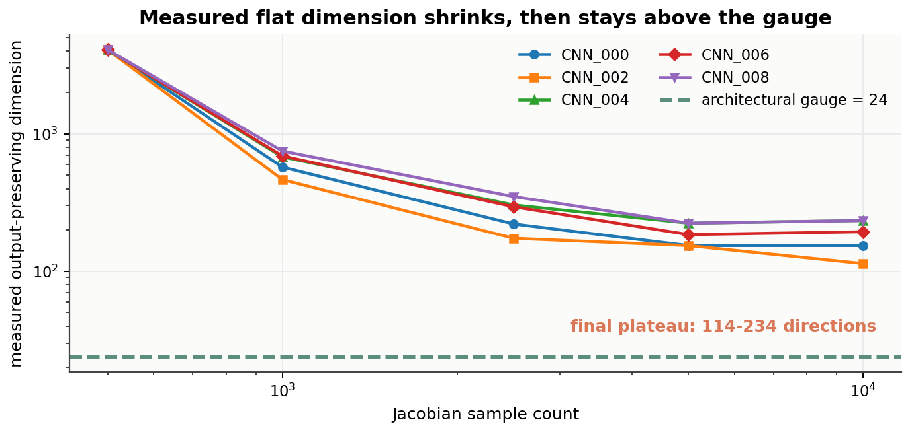
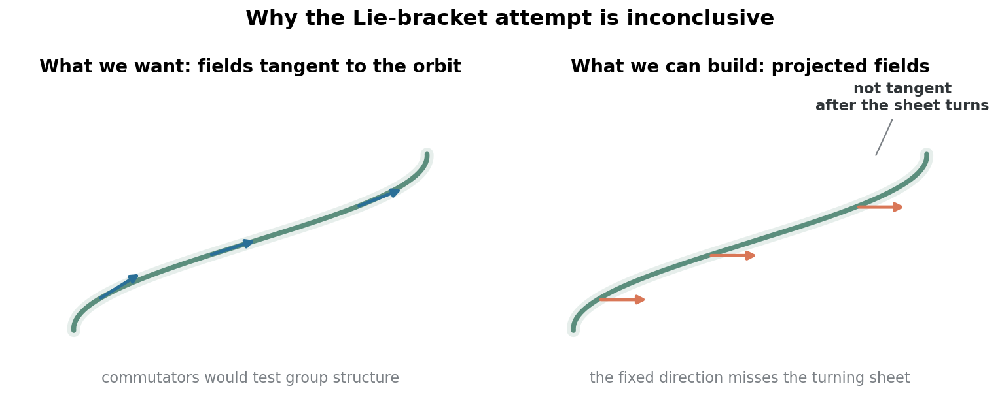

# EqNet

EqNet is a small preliminary project for a research proposal about learned
representation geometry.

The usual way to talk about a trained network is:

> training gives us one parameter vector.

But that sentence hides a coordinate problem. Neural network parameters are not
unique. Two different parameter vectors can compute the same function, or can
make almost the same predictions on the data we care about. Some differences
between parameter vectors are therefore real learned structure; others are only
bookkeeping.

The research proposal behind this repository asks a representation-learning
question:

> after removing parameter changes that do not change the network behavior,
> which parts of the learned representation remain stable?

Those stable parts are the candidate **representation invariants**. EqNet tests
the first measurable step needed for that question:

> Around a trained network, can we find parameter directions where the weights
> change but the network output barely changes?



## The Basic Question

Start with a trained network. Its parameters are a long vector, call it
`theta`.

Now imagine moving `theta` a tiny distance in some direction. There are two
kinds of directions:

1. **output-changing directions**: the network predictions change;
2. **output-preserving directions**: the parameters change, but the predictions
   barely change.

EqNet studies the second kind because they tell us which parts of parameter
space are not reliable evidence of learned structure. If a parameter direction
does not change the output, then a representation analysis that depends on that
direction may be explaining the coordinate system rather than the model.

Some output-preserving directions are already obvious from the architecture.
For example:

- if two hidden units are exchanged, the network can compute the same function;
- in a ReLU network, one channel can be multiplied by a positive number while
  the next layer is divided by the same number.

These are known "do-nothing" parameter changes. In the technical literature,
this known part is often called a **gauge**. In this README, "architectural
gauge" simply means:

> parameter changes that are already known to preserve the function because of
> the architecture.

The ReLU rescaling example is a standard consequence of positive homogeneity
and is closely related to the parameter-space caveats discussed by
[Dinh et al. (2017)](#references). The hidden-unit permutation example is the
same kind of redundancy studied in work on permutation invariance and model
matching, such as [Entezari et al. (2022)](#references) and
[Ainsworth et al. (2023)](#references).

The important question is not whether these known directions exist. They do.
The important question is:

> Are there more output-preserving directions than the known architectural ones?

If not, then this project is mostly re-describing known facts. If yes, then the
trained network has extra local structure that is not explained by the
architecture alone.

## How EqNet Looks for These Directions

EqNet uses a standard calculus object: the derivative of the network output
with respect to the parameters.

For a scalar function `f(x)`, the derivative tells us how `f` changes when `x`
moves. For a neural network, the input-output function depends on many
parameters, so the derivative becomes a matrix. This matrix is called the
**Jacobian**:

```text
J(theta) = partial f(x; theta) / partial theta
```

Think of `J` as a sensitivity table. It tells us which parameter movements
change the network output.

If `v` is a direction in parameter space, then:

```text
J(theta) v
```

is the first-order change in the network output when we move the parameters
along `v`. So:

```text
J(theta) v ≈ 0
```

means:

> moving in direction `v` barely changes the output, at least locally and on the
> measured data.

So EqNet does this:

1. train a network;
2. compute `J`;
3. find directions where `J(theta) v` is close to zero;
4. compare the number of such directions with the number already explained by
   the architecture.

## Experiment 1: Check the Measuring Tool on a Case Where We Know the Answer

Before looking for anything new, EqNet first checks whether the measuring tool
behaves sensibly.

The test case is a two-layer ReLU MLP. For this model, we already know one
family of do-nothing moves: hidden-unit rescaling. If a hidden ReLU unit is
scaled up, the next layer can be scaled down to compensate, and the network
function stays the same.

In this repo's MLP, the hidden layer has 64 ReLU units. Each hidden unit has one
independent rescaling knob:

```text
incoming weights and bias of unit i  × c
outgoing weight from unit i          ÷ c
```

Because ReLU satisfies `ReLU(c z) = c ReLU(z)` for `c > 0`, this paired change
leaves the network output unchanged. So architecture alone predicts 64
independent do-nothing directions for this MLP.

This gives a known answer. The measurement should find those known directions,
but it should not report lots of extra ones. This is why the MLP experiment is
a calibration experiment, not a discovery experiment.

That is what happens. On the MLP, the nearly output-preserving directions found
from the Jacobian match the known architectural ones.



This experiment is just a control. It says the Jacobian method is not
automatically turning every small numerical value into a new claim.

## Experiment 2: The CNN Has More Do-Nothing Directions Than Expected

After the control test, EqNet applies the same measurement to a small MNIST CNN.

For this CNN, the known architectural do-nothing moves have dimension 24. The
number comes from the ReLU feature channels:

```text
conv1 has 8 output channels
conv2 has 16 output channels
known channel-rescaling directions = 8 + 16 = 24
```

Each conv1 channel can be scaled while the corresponding input-channel weights
in conv2 are scaled back down. Each conv2 channel can be scaled while the
corresponding block of final linear-layer weights is scaled back down. These
paired changes preserve the network function for the same ReLU reason as in the
MLP.

So before doing any experiment, architecture alone predicts 24 independent
directions where parameters can move without changing the function.

If the architecture explained everything, EqNet should find about 24 such
directions.

Instead, across several trained CNNs, EqNet finds hundreds of extra directions:



This is the main observation:

> The trained CNN has many more locally output-preserving parameter directions
> than the architecture alone predicts.

This does not yet prove a full theory. It does not say we have discovered a
hidden symmetry group. It says something narrower: there is a measurable gap
between what the architecture explains and what is observed around trained CNN
solutions.

## Experiment 3: The Extra Directions Are Not Just a Matrix Artifact

A reasonable objection is:

> Maybe these directions only look special because of numerical details in the
> matrix calculation.

EqNet checks this directly. Instead of only looking at the Jacobian, it actually
moves the network parameters along the candidate directions and measures the
training loss.

If the directions are fake, moving along them should change the loss. If they
are real output-preserving directions, the loss should stay almost the same.

The result is clear:

- moving along the candidate flat directions keeps the loss almost unchanged;
- moving along high-curvature directions makes the loss increase quickly.



So the extra directions are not just small numbers in a matrix. The network can
actually move along them while keeping almost the same training behavior.

## Experiment 4: The Extra Directions Are Not Just Because We Used Too Few Data Points

There is another obvious objection.

The Jacobian is computed using a finite set of data points. If we use too few
points, there may be many directions that look output-preserving only because we
did not test enough inputs.

So EqNet repeats the measurement with more and more data points.

The logic is simple:

- if the extra directions are only a small-data artifact, they should disappear
  as more data points are used;
- if some of them are real, the count should drop at first and then stabilize
  above the 24 known architectural directions.

The result follows the second pattern:



The measured flat dimension drops when more data is used, but it does not drop
to the 24-dimensional architectural baseline. It stabilizes above that
baseline. Different trained CNNs stabilize at different values, which suggests
that the effect depends on the trained solution, not only on the fixed
architecture.

## What This Does Not Prove Yet

The experiments above show that extra locally output-preserving directions
exist in these small CNN runs. The next question is harder:

> Do these directions fit together into a clean mathematical structure?

One possible structure would be a hidden **symmetry**. Here symmetry means a
systematic rule for changing parameters while preserving the function, not just
a random collection of flat directions.

EqNet tried a first test for this, using a standard object called a **Lie
bracket**. A rough explanation is: if two tiny do-nothing moves really come
from a smooth symmetry rule, then doing them in different orders should produce
another move that still belongs to the same family. This is standard language
from Lie groups and vector fields; [Olver (1986)](#references) is a classical
reference.

The first test was inconclusive. The reason is that we can easily measure local
flat directions, but we do not yet know how to follow the full curved surface
formed by all equivalent parameters. If that surface bends, a direction that is
locally flat can stop being tangent after the surface turns.



So the safe conclusion is:

> EqNet finds extra local do-nothing directions, but it does not yet prove that
> they form a hidden symmetry group.

That open problem is exactly why this is useful as a research proposal: the
preliminary experiment finds a stable phenomenon, and the next work is to
understand its structure.

## Evidence Chain

The whole repository can be read as this chain:

```text
Different parameters can represent the same or nearly same network behavior
  -> known architectural do-nothing moves explain some of this
  -> EqNet asks whether trained networks have more such directions
  -> the Jacobian measures local output sensitivity
  -> an MLP control checks that the measurement returns the known answer
  -> a CNN shows many more directions than the known architectural baseline
  -> parameter walks show these directions really keep loss nearly fixed
  -> using more data points does not remove the effect
  -> the deeper structure is still open
```

In short: EqNet is not a final theory. The intended next question is
representation-level: after quotienting these do-nothing parameter moves, which
quantities such as rank, sparsity, subspace angles, coding-rate reduction, or
inter-class incoherence remain stable?

## Repository Layout

```text
notebooks/    four single-anchor walkthroughs for understanding the experiments
src/          training, Jacobian, tangent-dimension, Lie-test, and plotting code
figs/         README figures generated from stored results
results/      JSON and NPZ files behind the README figures
```

The README figures are generated from `results/` by `src/plots.py`. The
notebooks are explanatory walkthroughs of the same logic, not the canonical
full-sweep entry point. They intentionally use one anchor at a time so that the
calculation is readable in Jupyter.

The notebooks are ordered by research logic:

| notebook | purpose |
|---|---|
| `notebooks/01_extras_exist.ipynb` | compare measured do-nothing directions with the architectural baseline |
| `notebooks/02_walk_test.ipynb` | check whether candidate directions keep loss nearly fixed |
| `notebooks/03_extras_real_or_artifact.ipynb` | test whether extras disappear when more data points are used |
| `notebooks/04_lie_bracket_attempt.ipynb` | record why the first hidden-symmetry test is inconclusive |

## References

- Dinh, Pascanu, Bengio, and Bengio, [*Sharp Minima Can Generalize For Deep
  Nets*](https://proceedings.mlr.press/v70/dinh17b.html), ICML 2017. Relevant
  here for ReLU rescaling and the warning that parameter-space flatness can be
  distorted by architecture-induced reparameterizations.
- Entezari, Sedghi, Saukh, and Neyshabur, [*The Role of Permutation Invariance
  in Linear Mode Connectivity of Neural
  Networks*](https://research.google/pubs/the-role-of-permutation-invariance-in-linear-mode-connectivity-of-neural-networks/),
  ICLR 2022. Relevant here for hidden-unit permutation as a functional
  redundancy.
- Ainsworth, Hayase, and Srinivasa, [*Git Re-Basin: Merging Models modulo
  Permutation Symmetries*](https://openreview.net/forum?id=CQsmMYmlP5T), ICLR
  2023. Relevant here for aligning independently trained networks through known
  permutation freedoms.
- Olver, [*Applications of Lie Groups to Differential
  Equations*](https://link.springer.com/book/10.1007/978-1-4684-0274-2),
  Springer, 1986. Relevant here for the Lie-bracket language used in the
  attempted hidden-symmetry test.

## Reproducing the Figures

The repository includes stored result files, so the README figures can be
regenerated without rerunning all training jobs:

```bash
pip install -r requirements.txt
python -m src.plots results
```

To rerun the expensive parts from scratch, first train the checkpoints:

```bash
python -m src.train_main mlp --n 50
python -m src.train_main cnn --n 10 --data_dir ./mnist_data
```

The local-geometry script regenerates the spectrum NPZ files and the walk-test
JSON files used by the first three figures:

```bash
python -m src.run_local_geometry mlp \
    --ckpt_dir ckpts/mlp \
    --anchors MLP_000 MLP_010 MLP_020 MLP_030 MLP_040 \
    --out_json results/walk_test_mlp.json

python -m src.run_local_geometry cnn \
    --ckpt_dir ckpts/cnn \
    --anchors CNN_000 CNN_002 CNN_004 CNN_006 CNN_008 \
    --data_dir ./mnist_data \
    --n_samples 1500 \
    --out_json results/walk_test_cnn.json
```

The larger tangent-dimension scaling and Lie-test sweeps have separate script
entry points:

```bash
python -m src.run_tangent_dim \
    --ckpt_dir ckpts/cnn \
    --anchors CNN_000 CNN_002 CNN_004 CNN_006 CNN_008 \
    --n_grid 500 1000 2500 5000 10000 \
    --out results/tangent_dim_scaling.json

python -m src.run_lie_test --target mlp_gauge \
    --ckpt_dir ckpts/mlp --anchors MLP_000 MLP_010 MLP_020 \
    --n_pairs 10 --out results/lie_test_mlp.json

python -m src.run_lie_test --target cnn \
    --ckpt_dir ckpts/cnn --anchors CNN_000 CNN_002 CNN_004 \
    --n_pairs 5 --out results/lie_test_cnn.json
```

After updating `results/`, regenerate the README figures with:

```bash
python -m src.plots results
```
